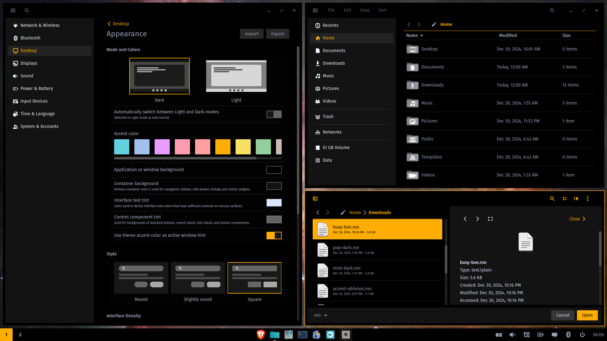
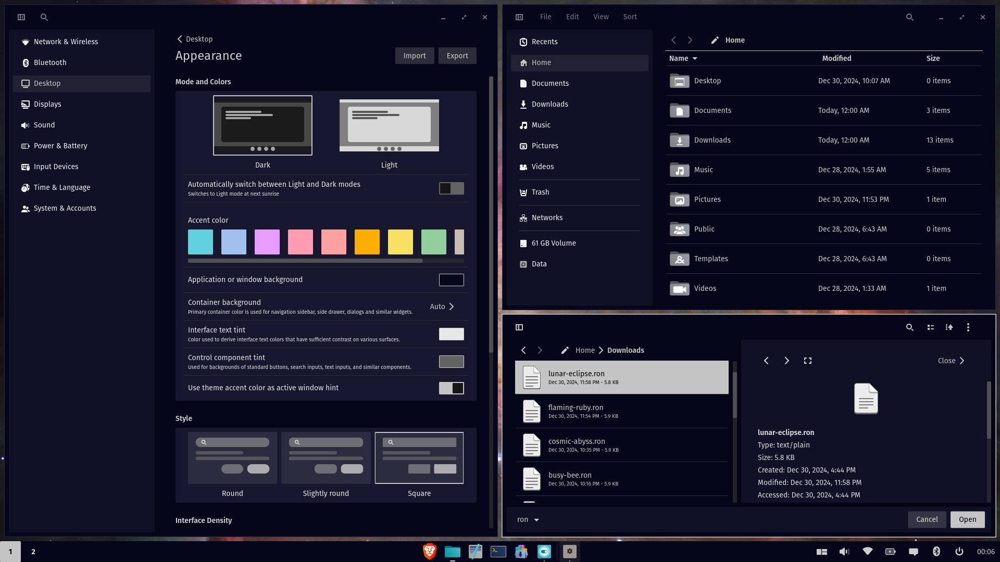
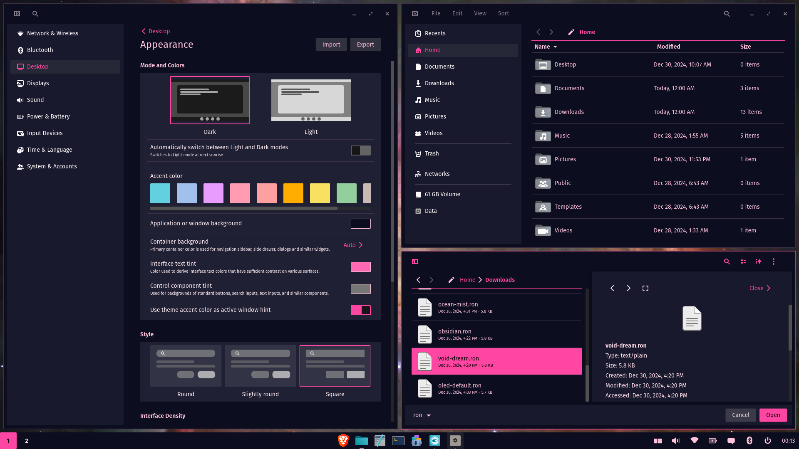
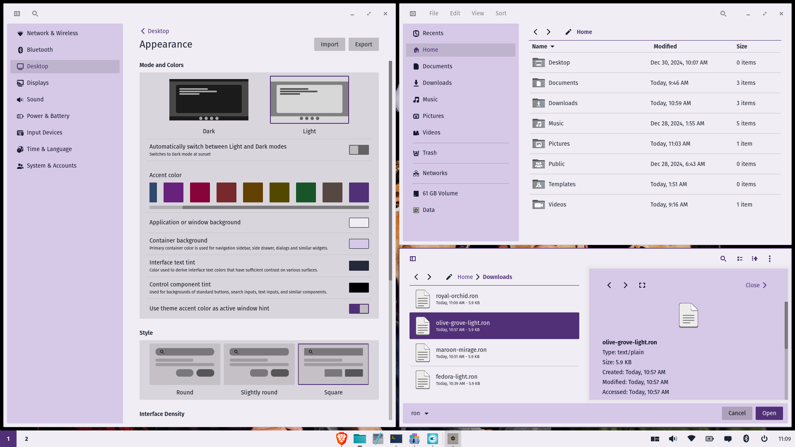

# Cosmic Desktop Themes

A collection of beautiful themes to customize and enhance the Cosmic Desktop Environment.

## Official Themes

| **Comet Light** | **Cosmic Dark** |
|------------------|-----------------|
|  |  |

| **Cosmic Light Dark** | **Creme Light** |
|------------------|-----------------|
|  |  |

| **Mocha Dark** | **Nebula Dark** |
|------------------|-----------------|
|  |  |

## Dark Themes

| **Accent Dark** | **Busy Bee** |
|------------------|-----------------|
|  |  |

| **Caramel Dark** | **Cosmic Abyss** |
|------------------|-----------------|
|  |  |

| **Cosmic Crimson** | **Flaming Ruby** |
|------------------|-----------------|
|  |  |

| **Hot Iron** | **Lunar Eclipse** |
|------------------|-----------------|
|  |  |

| **Mint Dark** | **Monokai** |
|------------------|-----------------|
|  |  |

| **Obsidian** | **Ocean Mist** |
|------------------|-----------------|
|  |  |

| **Omnitrix** | **Shadcn Dark** |
|------------------|-----------------|
|  |  |

| **Ubuntu Classic Dark** | **Void Dream** |
|------------------|-----------------|
|  |  |

## Light Themes

| **Accent Light** | **Caramel Light** |
|------------------|-----------------|
|  |  |

| **Lemon Grass** | **Maroon Mirage** |
|------------------|-----------------|
|  |  |

| **Mint Light** | **Royal Orchid** |
|------------------|-----------------|
|  |  |

| **Shadcn Light** | **Ubuntu Classic** |
|------------------|-----------------|
|  |  |

| **Ubuntu Light** |
|------------------|
|  | 

### How to Apply a Theme
1. Open Cosmic Settings.
2. Navigate to Desktop > Appearance.
3. Import desired theme file. 

Enjoy customizing your desktop with themes made for Cosmic!
