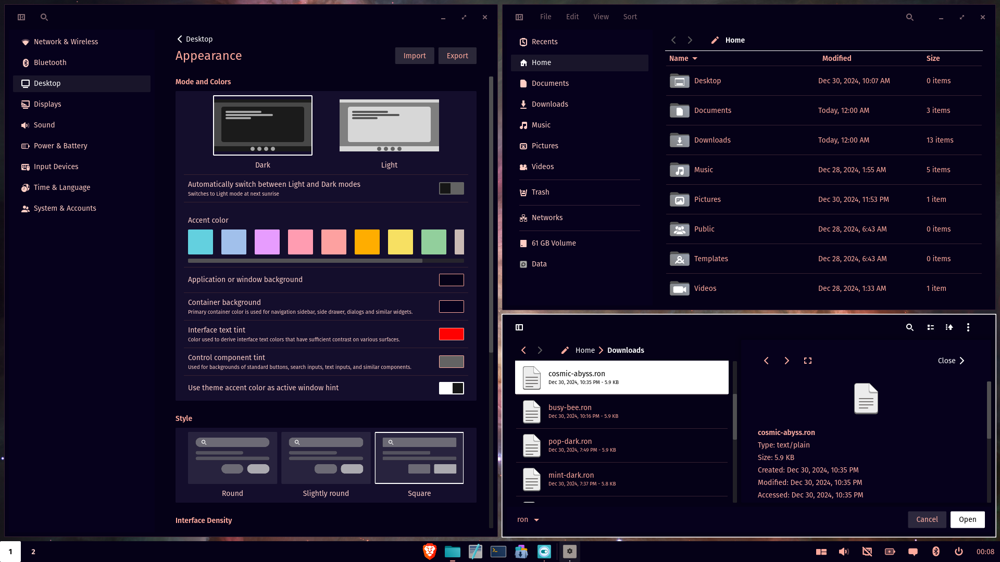
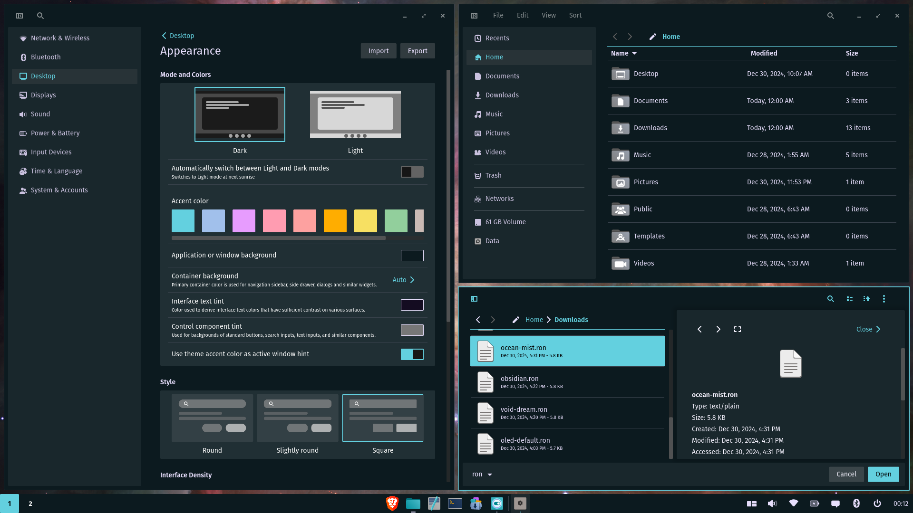
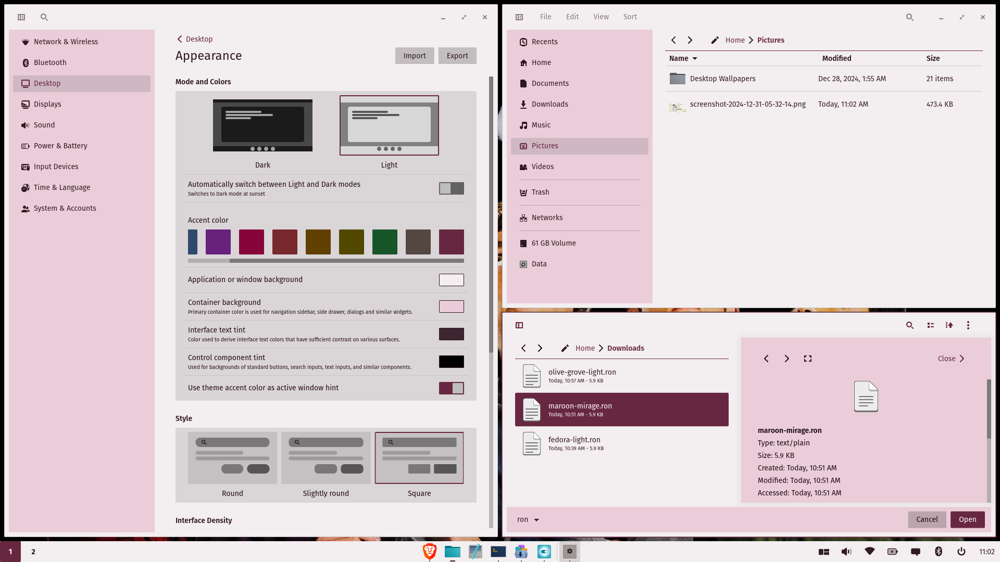

# Cosmic Desktop Themes

A collection of beautiful themes to customize and enhance the Cosmic Desktop Environment.

## Dark Themes

| **Accent Oblivion** | **Busy Bee** |
|------------------|-----------------|
|  |  |

| **Cosmic Abyss** | **Flaming Ruby** |
|------------------|-----------------|
|  |  |

| **Hot Iron** | **Lunar Eclipse** |
|------------------|-----------------|
|  |  |

| **Mint Dark** | **Nature** |
|------------------|-----------------|
|  |  |

| **Obsidian** | **Ocean Mist** |
|------------------|-----------------|
|  |  |

| **Oled Default** | **Pop Dark** |
|------------------|-----------------|
|  |  |

| **Void Dream** |
|------------------|
|  | 

## Light Themes

| **Fedora Light** | **Maroon Mirage** |
|------------------|-----------------|
|  |  |

| **Mint Light** | **Royal Orchid** |
|------------------|-----------------|
|  |  |

| **Ubuntu Classic Light** | **Ubuntu Light** |
|------------------|-----------------|
|  |  |

---

### How to Apply a Theme
1. Open Cosmic Settings.
2. Navigate to Desktop > Appearance.
3. Import desired theme file. 

Enjoy customizing your desktop with themes made for Cosmic!
